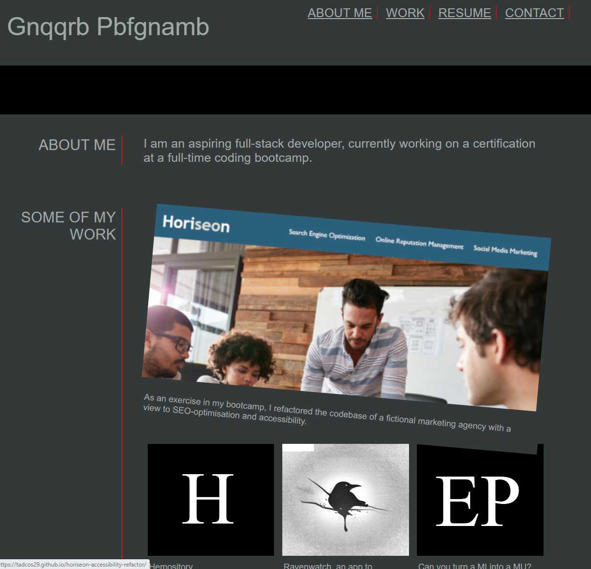

# Responsive Developer Portfolio

## Introduction and Purpose:

This is an exercise I did as part of my study of CSS techniques at the coding bootcamp. The focus was to learn how to create websites that remain aesthetically pleasing at any viewport.

## Results:

The refactored site is currently live on [GitHub Pages](https://tadcos29.github.io/responsive-portfolio/) 

The GitHub repository for the project is: https://github.com/tadcos29/responsive-portfolio

